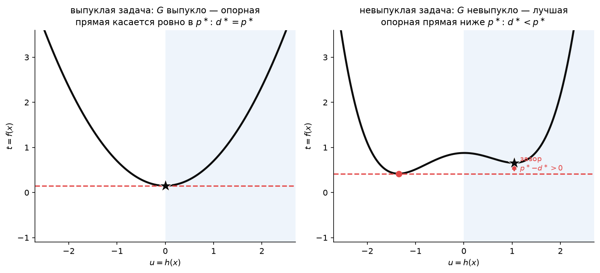
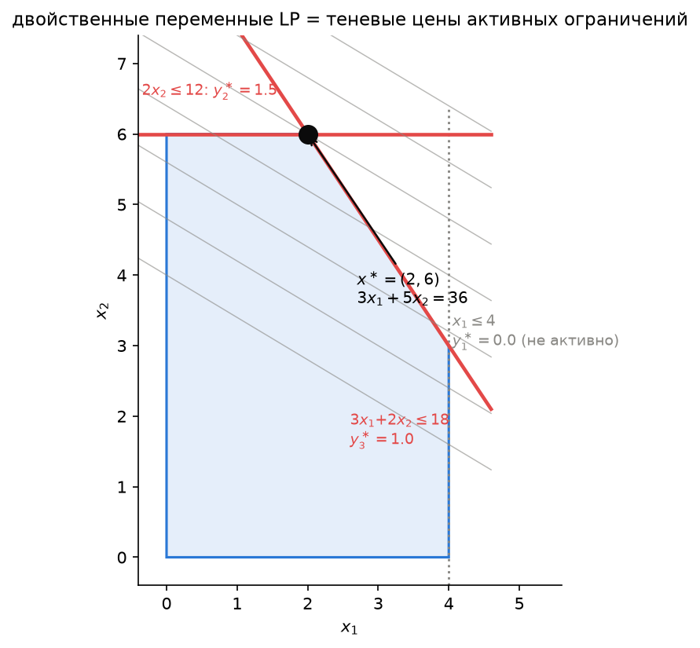
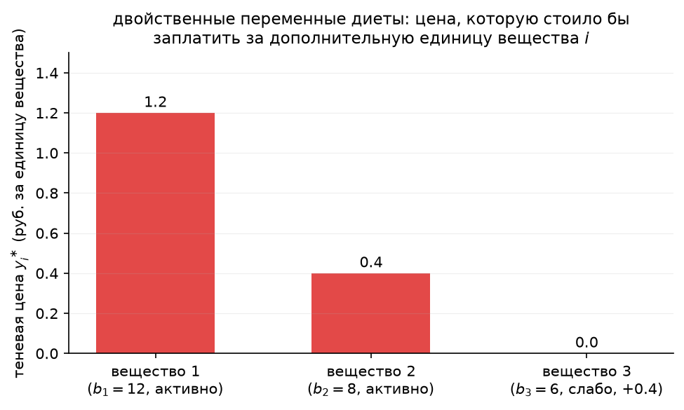
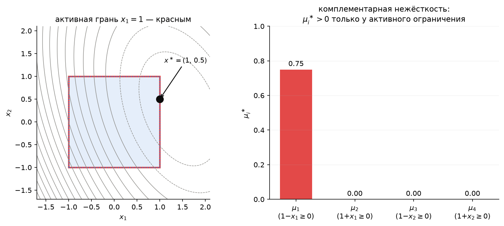
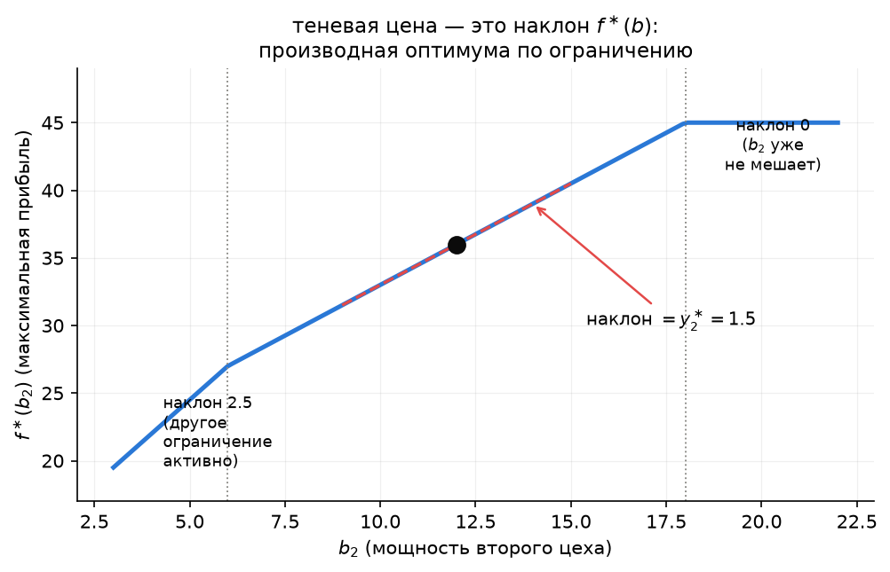

# Лекция 3. Двойственность Лагранжа

*Вычислительная оптимизация, магистратура, 1 курс. 23 сентября 2026.*

**План лекции**

1. Что мы обещали на лекции 2
2. Функция Лагранжа
3. Двойственная функция и слабая двойственность
4. Пример на пальцах: одномерная задача
5. Геометрическая интерпретация
6. Двойственная задача и зазор двойственности
7. Условие Слейтера и сильная двойственность
8. Двойственность LP
9. Двойственность QP
10. Что это даёт численно
11. Итоги лекции
12. Что дальше
13. Практика на занятии
14. Упражнения

Конспект опирается на главу 4 лекционных заметок М. Диля (*Lecture Notes on Numerical Optimization*, 2017) и главу 5 книги Boyd & Vandenberghe. Код демонстраций — ноутбук [`demo03.ipynb`](demo03.ipynb). Картинки конспекта строятся скриптом [`make_figures.py`](make_figures.py).

---

## 1. Что мы обещали на лекции 2

Лекция 2 закончилась тремя обещаниями (раздел 8 и 10 прошлого конспекта): функция Лагранжа $L(x,\lambda,\mu) = f(x) - \lambda^\top g(x) - \mu^\top h(x)$, двойственная функция как **нижняя граница** $f^\ast$, слабая и сильная двойственность, условие Слейтера и двойственные задачи для LP и QP. Всё это — сегодня, одной сплошной линией рассуждений.

Зачем это нужно уже сейчас, до методов (часть II начнётся только с лекции 4)? Двойственность — это **второй способ** проверить решение, не зная правильного ответа заранее (первый — условие оптимальности из лекции 2, раздел 7, которое работает только для простых $\Omega$). А ещё — источник **множителей Лагранжа**, вокруг которых построена вся часть III курса (лекции 8–9), и **чувствительности** решения к данным задачи (лекция 14), которую мы сегодня увидим бесплатно, просто разбираясь с двойственностью.

Работать будем с тремя задачами, которые вы уже видели: планированием производства и подвешенной цепью (лекция 1), диетой из домашнего задания 1 и ящиком из демо к лекции 2. Ничего нового придумывать не придётся — сегодня мы посмотрим на старые задачи под новым углом.

## 2. Функция Лагранжа

Возьмём стандартную форму (NLP) из лекции 1:

$$
\min_x f(x) \quad\text{при}\quad g(x) = 0,\ h(x) \ge 0 .
$$

**Определение.** Функция Лагранжа

$$
L(x, \lambda, \mu) \;=\; f(x) - \lambda^\top g(x) - \mu^\top h(x),
$$

где $\lambda \in \mathbb{R}^p$ — множители для равенств (знак любой), $\mu \in \mathbb{R}^m_{\ge 0}$ — множители для неравенств (**обязательно** $\mu \ge 0$). Идея: вместо того чтобы штрафовать нарушение ограничений явно, мы **вычитаем** сами ограничения с весами $\lambda,\mu$ и смотрим, что происходит с минимумом по $x$ уже без ограничений вовсе.

Знак у $\mu$ — не формальность. В нашем соглашении $h(x) \ge 0$ означает «хорошо», $h(x) < 0$ — нарушение. При $\mu \ge 0$ и **допустимом** $x$ слагаемое $-\mu^\top h(x) \le 0$: Лагранжиан на допустимых точках **не больше** $f(x)$. Это неравенство — сердце всего, что будет дальше сегодня, и мы используем его уже в следующем разделе.

Как это соотносится с записью Бойда ($f_i(x) \le 0$)?

Boyd & Vandenberghe пишут неравенства как $f_i(x) \le 0$ с множителями $\lambda_i \ge 0$ и $L = f_0 + \sum_i \lambda_i f_i + \nu^\top h$. Поскольку наше $h(x) = -f_i(x)$ (лекция 2, замечание о соглашениях), $L_{\text{Boyd}} = f - \lambda^\top(-h) + \nu^\top g = f - \lambda^\top h + \nu^\top g$ — то же самое с точностью до переименования $\lambda \leftrightarrow \mu$, $\nu \leftrightarrow -\lambda$. При чтении Boyd или документации солверов держите это в голове.

**Пример (планирование производства, лекция 1, §7.2).** $\min(-3x_1 - 5x_2)$ при $h(x) = (4 - x_1,\ 12 - 2x_2,\ 18 - 3x_1 - 2x_2,\ x_1,\ x_2) \ge 0$ (пять неравенств, равенств нет). Лагранжиан с $\mu = (\mu_1,\dots,\mu_5) \ge 0$:

$$
L(x,\mu) = -3x_1 - 5x_2 - \mu_1(4 - x_1) - \mu_2(12 - 2x_2) - \mu_3(18 - 3x_1 - 2x_2) - \mu_4 x_1 - \mu_5 x_2 .
$$

Мы вернёмся к этому примеру в разделе 8 — все пять $\mu_i$ там будут посчитаны.

## 3. Двойственная функция и слабая двойственность

**Определение.** Двойственная функция

$$
d(\lambda, \mu) \;=\; \inf_{x} L(x, \lambda, \mu) .
$$

Инфимум берётся по **всем** $x$ (даже недопустимым!) — в этом всё дело. Убрав ограничения, мы часто можем взять минимум по $x$ в закрытой форме или простой численной задачей, хотя исходная задача с ограничениями могла быть сложной.

**Теорема (слабая двойственность).** Для любых $\lambda$ и $\mu \ge 0$

$$
d(\lambda, \mu) \;\le\; p^\ast ,
$$

где $p^\ast = \min\{f(x) : g(x)=0,\ h(x)\ge 0\}$ — оптимальное значение исходной («примальной») задачи. **Это верно всегда — выпуклая задача или нет.**

*Доказательство.* Пусть $\bar x$ — любая допустимая точка ($g(\bar x)=0$, $h(\bar x)\ge 0$) и $\mu \ge 0$. Тогда

$$
L(\bar x, \lambda, \mu) = f(\bar x) - \lambda^\top \underbrace{g(\bar x)}_{=\,0} - \mu^\top \underbrace{h(\bar x)}_{\ge\, 0} \;\le\; f(\bar x),
$$

поскольку $\mu^\top h(\bar x) \ge 0$. А так как $d(\lambda,\mu) = \inf_x L(x,\lambda,\mu) \le L(\bar x,\lambda,\mu)$ (инфимум не больше значения в конкретной точке), получаем $d(\lambda,\mu) \le f(\bar x)$ для **любой** допустимой $\bar x$, в частности для оптимальной — откуда $d(\lambda,\mu) \le p^\ast$. $\blacksquare$

Практический смысл огромен: **любая** допустимая пара $(\lambda,\mu)$ с $\mu \ge 0$ даёт **гарантированную** нижнюю границу на $p^\ast$ — не решая исходную задачу и даже не зная, чему равен $p^\ast$. Это и есть обещанный в лекции 2 «сертификат»: если вы нашли допустимую точку $\bar x$ и пару $(\lambda,\mu)$ такие, что $f(\bar x) = d(\lambda,\mu)$, то по цепочке неравенств выше $\bar x$ — точное решение, доказано без всякого перебора.

## 4. Пример на пальцах: одномерная задача

$$
\min_x (x-2)^2 \quad\text{при}\quad x \ge 3 .
$$

Ответ виден сразу: парабола с вершиной в $2$ растёт при $x>2$, значит, на $x \ge 3$ минимум — в граничной точке $x^\ast = 3$, $f^\ast = 1$. Проверим то же через двойственность.

Лагранжиан ($h(x) = x - 3 \ge 0$, один множитель $\mu \ge 0$):

$$
L(x,\mu) = (x-2)^2 - \mu(x-3).
$$

Для фиксированного $\mu$ это по-прежнему парабола по $x$ (только с других мест вершиной), и её минимум находится school-калькулусом: $\dfrac{\partial L}{\partial x} = 2(x-2) - \mu = 0 \Rightarrow x^\ast(\mu) = 2 + \dfrac{\mu}{2}$. Подставляя обратно:

$$
d(\mu) = \Big(\frac{\mu}{2}\Big)^2 - \mu\Big(\frac{\mu}{2} - 1\Big) = -\frac{\mu^2}{4} + \mu .
$$

Проверим слабую двойственность на числах: $d(0)=0$, $d(1)=0.75$, $d(2)=1$, $d(3)=0.75$ — все $\le p^\ast = 1$, как и обещала теорема раздела 3. При $\mu=2$ неравенство обращается в **равенство**: $d(2) = 1 = p^\ast$. Заметьте и по картинке выше: именно при $\mu=2$ минимум $L(x,2)$ (чёрная точка) совпадает с $x^\ast=3$ — сдвигаясь, парабола семейства «доехала» ровно до границы допустимой области.

$d(\mu)$ сама по себе — вогнутая функция от $\mu$ (парабола, направленная вниз), хотя мы вообще ничего не предполагали о выпуклости исходной задачи: $\inf_x$ линейной по $(\lambda,\mu)$ функции — всегда вогнутая функция $(\lambda,\mu)$ (как поточечный инфимум линейных функций; ср. лекцию 2, раздел 5, операция «максимум» — здесь то же самое с обратным знаком). Значит, максимизировать $d$ — это **всегда** задача выпуклой оптимизации, даже если исходная задача была невыпуклой! Максимум $d(\mu) = -\mu^2/4+\mu$ находится тем же способом: $d'(\mu) = -\mu/2+1=0 \Rightarrow \mu^\ast=2$, $d^\ast = 1$.

## 5. Геометрическая интерпретация

Есть ещё один взгляд на то же самое, который многое объясняет разом. Рассмотрим множество достижимых пар «(значение ограничения, значение цели)»:

$$
G = \{(u,t) : u = h(x),\ t = f(x),\ x \in \mathbb{R}^n\} \subset \mathbb{R}^{m+1}
$$

(для простоты — только неравенства). Тогда:

- $p^\ast$ — это минимальное $t$ среди точек $G$ с $u \ge 0$ (допустимая часть, на картинке — голубая полуплоскость);
- при фиксированном $\mu \ge 0$ минимизировать $L(x,\mu) = t - \mu^\top u$ по $x$ — то же самое, что найти самую низкую точку множества $G$ на прямой с наклоном $\mu$, то есть найти, где прямая $t = \mu u + d(\mu)$ **касается** $G$ снизу (**опорная прямая**); $d(\mu)$ — это её пересечение с осью $u=0$.

Для нашего примера $u = x-3$, $t=(x-2)^2 = (u+1)^2$ — это ровно чёрная парабола на картинке. Опорная прямая с наклоном $\mu$ пересекает ось $u=0$ на высоте $d(\mu)$; чем круче наклон, тем выше поднимается точка пересечения — вплоть до $\mu^\ast=2$, где прямая касается параболы **ровно в допустимой точке** $u=0$ ($x=3$). Дальше поднять прямую нельзя — она пересечёт параболу и перестанет быть опорной. Отсюда видно главное:

> **Слабая двойственность — это то, что опорная прямая идёт не выше $G$.** **Сильная двойственность** ($d^\ast=p^\ast$) — это то, что нашлась опорная прямая, касающаяся $G$ *ровно в допустимой точке минимума*.

Это переформулировка теоремы раздела 3 на языке выпуклой геометрии, и уже понятно, при чём тут выпуклость $G$ — см. раздел 6.

## 6. Двойственная задача и зазор двойственности

**Определение (двойственная задача).**

$$
d^\ast = \max_{\lambda,\ \mu \ge 0} d(\lambda,\mu).
$$

Это **всегда задача выпуклой оптимизации** (раздел 4: $d$ вогнута, множество $\mu\ge 0$ выпукло), даже когда исходная («примальная») задача невыпукла. Разность

$$
p^\ast - d^\ast \;\ge\; 0
$$

называется **зазором двойственности** (duality gap). Слабая двойственность (раздел 3) гарантирует, что зазор неотрицателен, — но не гарантирует, что он равен нулю.

**Когда зазор строго положителен.** Геометрически (раздел 5) — когда множество $G$ **невыпукло**: тогда наилучшая снизу опорная (обязательно *прямая*, то есть линейная, аффинная) не может подойти к $G$ ближе, чем позволяет его выпуклая оболочка, и точка настоящего минимума может оказаться в «кармане», недостижимом ни для какой опорной прямой.

**Пример с бесконечным зазором.** Возьмём функцию $-x_1x_2$ — ту самую невыпуклую функцию из «прямоугольника в круге» (лекция 1, §7.1 переформулировка; HW2, задача 1) — но теперь на **другом**, многоугольном множестве:

$$
\min_x -x_1x_2 \quad\text{при}\quad x_1+x_2\le 1,\ x_1\ge 0,\ x_2\ge 0 .
$$

По неравенству о средних, при фиксированной сумме $x_1+x_2=s$ произведение $x_1x_2$ максимально при $x_1=x_2=s/2$ и растёт с $s$; лучший вариант — взять $s=1$ целиком. Значит, $p^\ast = -1/4$ при $x^\ast=(0.5,0.5)$ (проверено численно в demo03.ipynb). А что с двойственной функцией? Лагранжиан $L(x,\mu) = -x_1x_2 - \mu_1(1-x_1-x_2) - \mu_2 x_1 - \mu_3 x_2$ — квадратичная форма от $x$ с матрицей $\begin{pmatrix} 0 & -1/2 \\ -1/2 & 0\end{pmatrix}\!\cdot 2$, у которой собственные числа $\pm 1$ — **индефинитная**, независимо от $\mu$. Значит, $\inf_{x\in\mathbb{R}^2} L(x,\mu) = -\infty$ для **любого** $\mu\ge 0$ (двигаясь по диагонали $x_1=x_2=t\to\infty$, $L\to-\infty$; проверка — в demo03.ipynb). Отсюда $d(\mu)\equiv -\infty$, $d^\ast=-\infty$, зазор бесконечен: двойственная функция вообще ничего не говорит о решении.

Мораль: невыпуклость цели, не «выключенная» ограничениями, делает *релаксацию* Лагранжа бесполезной — минимизация по всем $x\in\mathbb{R}^n$ без учёта области определения теряет всю информацию, которую давали ограничения. (В HW2 та же функция $-x_1x_2$ на **круге** $x_1^2+x_2^2=1$ вела себя иначе и вовсе не давала зазора — см. раздел 14.5, это не случайно и не противоречие: единственное квадратичное равенство — особый, «почти выпуклый» случай.)

## 7. Условие Слейтера и сильная двойственность

Хорошая новость: для широкого и практически важного класса задач зазора нет **никогда**.

**Условие Слейтера.** Существует **строго допустимая** точка $\tilde x$: $g(\tilde x)=0$ и $h_i(\tilde x) > 0$ для всех $i$, у которых $h_i$ **нелинейна**. (Если $h_i$ аффинно — $h_i(x) = a_i^\top x - b_i$, — для него достаточно обычной допустимости $h_i(\tilde x)\ge 0$, строгость не нужна: аффинное множество и так «ведёт себя хорошо».)

**Теорема (сильная двойственность).** Если задача **выпукла** ($f$ выпукла, $g$ аффинно, $h_i$ вогнуты — чек-лист лекции 2, раздел 6) и выполнено условие Слейтера, то

$$
d^\ast = p^\ast
$$

(зазора нет), и максимум в двойственной задаче достигается — существует пара $(\lambda^\ast,\mu^\ast)$ с $d(\lambda^\ast,\mu^\ast)=p^\ast$.

Доказательство длинное (теорема отделимости выпуклых множеств — Diehl, гл. 4; Boyd & Vandenberghe, §5.3.2); в курсе не разбираем, но идея — прямое обобщение картинки раздела 5: строгая внутренняя точка не даёт множеству $G$ «прижаться» к границе $u=0$ настолько, чтобы опорная прямая не смогла её нащупать.

**Следствие (комплементарная нежёсткость).** Если $x^\ast$ решает примальную, а $(\lambda^\ast,\mu^\ast)$ — двойственную задачу и $d^\ast=p^\ast$, то в цепочке неравенств доказательства раздела 3 **всюду равенство**, в частности

$$
\mu_i^\ast\, h_i(x^\ast) = 0 \quad\text{для каждого } i .
$$

То есть **для каждого ограничения хотя бы одно из двух — множитель или невязка — равно нулю**: активное ограничение может иметь ненулевой множитель, неактивное — обязано иметь нулевой. Это первая половина условий ККТ (лекция 10 соберёт их все); сегодня мы будем проверять её на числах в разделах 8–9.

**Три наших примера удовлетворяют условиям теоремы.** LP из §7.2 лекции 1 — выпукла (всё аффинно), любая точка внутри многоугольника, например $(1,1)$, строго допустима (все неравенства строгие) — Слейтер выполнен автоматически, как и для *любой* задачи, у которой все ограничения линейны (раздел 14.4). Диета из ДЗ 1 — та же история. Ящик из демо к лекции 2 ($f$ — выпуклая QP с $Q\succ 0$, ограничения — линейные) — тоже. Поэтому для всех трёх ниже мы гарантированно найдём $d^\ast=p^\ast$ — и проверим это на числах.

## 8. Двойственность LP

Возьмём LP в форме «$\max$» (как у нас в примерах): $\max_x c^\top x$ при $Ax \le b$, $x \ge 0$. В нашей стандартной форме это $\min(-c^\top x)$ при $h(x) = (b-Ax,\ x) \ge 0$. Лагранжиан с множителями $y\ge 0$ на первые $m$ строк ($Ax\le b$) и $s\ge 0$ на $x\ge 0$:

$$
L(x,y,s) = -c^\top x - y^\top(b-Ax) - s^\top x = (A^\top y - c - s)^\top x - b^\top y .
$$

Это **линейно по $x\in\mathbb{R}^n$** (никакой квадратичной части — сравните с разделом 4, там была парабола). Инфимум линейной функции по всему пространству равен $-\infty$, если только коэффициент при $x$ не равен нулю: $d(y,s) = -b^\top y$, если $A^\top y - c - s = 0$, и $-\infty$ иначе. Условие $s\ge 0$ вместе с $A^\top y - c = s$ означает просто $A^\top y \ge c$. Убирая бесполезную $s$, получаем классическую пару:

| Примальная (max) | Двойственная (min) |
|---|---|
| $\max_x c^\top x$ | $\min_y b^\top y$ |
| $Ax \le b$ | $A^\top y \ge c$ |
| $x \ge 0$ | $y \ge 0$ |

Слейтер для LP выполнен всегда, когда допустимое множество непусто (раздел 14.4) — значит, **для любой разрешимой LP зазора нет**, безусловно. Числа $y_i^\ast$ называют **теневыми ценами** (shadow prices): $y_i^\ast$ — это то, насколько вырастет $p^\ast$, если ослабить $i$-е ограничение на единицу (раздел 10 покажет это явно).

**Пример 1: планирование производства.** Решаем `linprog`:

$$
x^\ast = (2,6), \quad p^\ast = 36, \quad y^\ast = (0,\ 1.5,\ 1).
$$

Комплементарная нежёсткость на числах: ограничение 1 ($x_1\le 4$) в оптимуме неактивно (запас $4-2=2>0$) — и его множитель $y_1^\ast=0$, как и обещано следствием раздела 7. Ограничения 2 и 3 активны (касание в вершине) — их множители положительны.

**Пример 2: диета (ДЗ 1).** Здесь примальная задача — минимизация, $\min c^\top x$ при $Ax\ge b$, $x\ge 0$; проделав то же рассуждение (или просто переобозначив $h = (Ax-b,\ x)\ge 0$), двойственная — $\max_y b^\top y$ при $A^\top y \le c$, $y\ge 0$. Для данных ДЗ 1 ($c=(2,3,1.5,4)$, три вещества, $b=(12,8,6)$):

$$
x^\ast = (2.4,\ 0,\ 0,\ 3.2), \quad p^\ast = 17.6, \quad y^\ast = (1.2,\ 0.4,\ 0).
$$

Экономический смысл двойственных переменных диеты — классическая иллюстрация из учебников: представьте продавца синтетических таблеток, который предлагает вещество $i$ по цене $y_i$ за единицу. Чтобы конкурировать с настоящими продуктами, для каждого продукта $j$ должно быть $\sum_i A_{ij} y_i \le c_j$ (иначе покупатель предпочтёт продукт) — это ровно двойственное ограничение $A^\top y \le c$! Максимальная выручка такого продавца ($\max b^\top y$) равна минимальным расходам покупателя ($\min c^\top x$) — потому и нет зазора. Ограничение 3 (третье вещество) не активно (запас $0.4$) — его цена $y_3^\ast=0$: если продукт и так в избытке, за него не переплачивают.

## 9. Двойственность QP

Возьмём QP с линейными неравенствами: $\min_x \tfrac12 x^\top Q x + c^\top x$ при $Ax\le b$, $Q\succ 0$. Лагранжиан $L(x,\mu) = \tfrac12 x^\top Qx + c^\top x - \mu^\top(b-Ax) = \tfrac12 x^\top Qx + (c+A^\top\mu)^\top x - \mu^\top b$. В отличие от LP, здесь по $x$ — снова **квадратичная** функция с той же $Q\succ 0$ (не зависит от $\mu$!) — инфимум всегда конечен и берётся явно, как в разделе 4:

$$
x(\mu) = -Q^{-1}(c+A^\top\mu), \qquad d(\mu) = -\tfrac12(c+A^\top\mu)^\top Q^{-1}(c+A^\top\mu) - \mu^\top b .
$$

Двойственная задача $\max_{\mu\ge 0} d(\mu)$ — это **тоже QP** (максимизация вогнутой квадратичной функции с простым ограничением $\mu\ge 0$), обычно меньшей или структурно более простой размерности; на этом факте построены целые семейства методов (активных множеств, лекция 11).

**Пример: ящик из демо к лекции 2.** $Q=\begin{pmatrix}2 & 0.5\\0.5&1\end{pmatrix}$, $c=(-3,-1)$, ограничения $-1\le x_i\le 1$ (четыре неравенства $h=(1-x_1,\,1+x_1,\,1-x_2,\,1+x_2)\ge 0$). Решение уже известно (лекция 2, демо часть c): $x^\ast=(1,\,0.5)$, $f^\ast=-2.125$ — единственная активная грань $x_1=1$.

Максимизируя $d(\mu)$ по четырём $\mu\ge 0$ (демо03, часть b), получаем $\mu^\ast=(0.75,\,0,\,0,\,0)$ и $d^\ast=-2.125=f^\ast$ — сильная двойственность подтверждена численно. Комплементарная нежёсткость видна мгновенно на столбчатой диаграмме: положителен только множитель активного ограничения $x_1\le 1$, у трёх неактивных — ровно ноль.

## 10. Что это даёт численно

**`scipy.optimize.linprog` уже решает двойственную задачу за вас.** Поле `res.ineqlin.marginals` — это в точности (со знаком минус для задачи на максимум, см. демо03) теневые цены $y^\ast$: не нужно составлять и решать двойственную LP отдельно, как мы делали выше «для проверки», — солвер отдаёт множители вместе с решением одним вызовом.

**Чувствительность — это наклон.** Если решить LP из §8 для разных значений $b_2$ (мощность второго цеха) и построить $f^\ast(b_2)$, получится кусочно-линейная функция, наклон которой на каждом участке — это в точности теневая цена соответствующего ограничения:

При $b_2=12$ наклон равен $y_2^\ast=1.5$ — ровно то число, что мы получили из двойственной задачи. За пределами текущего диапазона (при $b_2<6$ или $b_2>18$) в игру вступает другое ограничение, наклон меняется — множители $y^\ast$ верны **локально**, пока не сменился набор активных ограничений (подробно — лекция 14).

**Сертификат остаётся сертификатом и без сильной двойственности.** Даже если задача невыпукла и зазор не гарантированно нулевой, *любая* допустимая пара $(\lambda,\mu)$, $\mu\ge0$, даёт законную нижнюю границу $d(\lambda,\mu)\le p^\ast$ (раздел 3) — полезно, например, чтобы оценить, насколько найденное локальным методом решение может быть далеко от глобального оптимума, даже не находя его.

## 11. Итоги лекции

1. Функция Лагранжа $L=f-\lambda^\top g-\mu^\top h$ ($\mu\ge0$) превращает задачу с ограничениями в безусловную; двойственная функция $d(\lambda,\mu)=\inf_x L$ всегда вогнута.
2. Слабая двойственность $d(\lambda,\mu)\le p^\ast$ верна безусловно — для любой задачи, выпуклой или нет; отсюда прямой сертификат оптимальности.
3. Геометрически: $p^\ast$ — минимум $t$ на множестве $G=\{(h(x),f(x))\}$ при $u\ge0$; $d(\mu)$ — пересечение опорной прямой наклона $\mu$ с осью $u=0$.
4. Двойственная задача $d^\ast=\max_{\mu\ge0}d$ — всегда выпуклая; зазор $p^\ast-d^\ast\ge0$ может быть строго положительным (и даже бесконечным) для невыпуклых задач.
5. Условие Слейтера (строгая допустимость по нелинейным неравенствам) плюс выпуклость $\Rightarrow$ сильная двойственность $d^\ast=p^\ast$ и комплементарная нежёсткость $\mu_i^\ast h_i(x^\ast)=0$.
6. Для LP и QP двойственная задача выписывается явно (LP $\to$ LP, QP $\to$ QP), а множители — это теневые цены: наклон $f^\ast$ по параметрам ограничений; `linprog` считает их бесплатно вместе с решением.

## 12. Что дальше

Этой лекцией заканчивается **часть I** курса (лекции 1–3: постановка задачи, выпуклость, двойственность) — три способа смотреть на любую задачу оптимизации ещё до того, как мы начали её *решать*. **Часть II** (лекции 4–7) — про то, как это делать: с лекции 4 начинается безусловная оптимизация (условия оптимальности без ограничений, градиентный спуск, скорость сходимости), а к лекции 7 мы дойдём до Ньютона и BFGS. Множители Лагранжа вернутся всерьёз в части III (лекции 8–9) — уже не только для неравенств, а полная система условий ККТ, объединяющая всё сказанное сегодня с условиями для равенств, — в лекции 10. Параметрическая чувствительность, которую мы увидели в разделе 10 на одном примере, станет отдельной темой лекции 14.

**Домашнее задание 3** выдаётся 7 октября (после лекции 5) — тема градиентный спуск, Ньютон, BFGS: реализация и сравнение (см. [программу курса](../../syllabus.md#4-домашние-задания)).

**Литература к лекции.** Diehl, глава 4 (Duality); Boyd & Vandenberghe, глава 5 (Duality); Поляк, гл. 1; Нестеров, гл. 3.

## 13. Практика на занятии

Вторая половина пары, около 40–45 минут (лекция сегодня длиннее обычного — часть I курса собирается воедино). Всё, что нужно, — ноутбук [`demo03.ipynb`](demo03.ipynb).

| Время | Что делаем |
|-------|-----------|
| 10 мин | `demo03.ipynb`, часть (a) вживую: одномерный пример раздела 4 — считаем $d(\mu)$ в коде, сверяем с формулой, рисуем семейство $L(x,\mu)$. |
| 10 мин | Часть (b): двойственность QP на ящике из лекции 2 — максимизируем $d(\mu)$ численно, сверяем $\mu^\ast$ и $d^\ast$ с уже известным $x^\ast$, комплементарная нежёсткость на числах. |
| 10 мин | Часть (c): LP планирования производства и диеты — `res.ineqlin.marginals` против ручного решения двойственной LP; упражнение 14.2 у доски. |
| 10–15 мин | Часть (d): невыпуклый пример раздела 6 ($d\equiv-\infty$) и «скрытая выпуклость» ректangle-in-circle из ДЗ 2 (упражнение 14.5) — обсуждение, когда двойственности можно доверять. |

## 14. Упражнения

Для разбора на занятии и самостоятельно. Подробный разбор с проверкой кодом — ноутбук [`exercises03.ipynb`](exercises03.ipynb), краткие ответы — [`exercises03.md`](exercises03.md).

**14.1.** Для задачи $\min_x x^2$ при $x\ge 2$ выпишите $L(x,\mu)$, найдите $d(\mu)$ в явном виде, вычислите $d(0), d(2), d(4)$ и убедитесь, что все они $\le p^\ast$. Найдите $\mu^\ast=\arg\max_\mu d(\mu)$ и проверьте $d^\ast=p^\ast$.

**14.2.** В LP планирования производства (раздел 8) увеличьте мощность третьего цеха с $18$ до $b_3$. Найдите (аналитически или перебором по `linprog`) значение $b_3$, при котором набор активных ограничений меняется, и новые теневые цены сразу после этой точки. Почему теневая цена ограничения 3 обязана обратиться в ноль ровно там, где оно перестаёт быть активным?

**14.3.** Возьмите QP $\min_x \tfrac12 x^\top Qx + c^\top x$ при $-1\le x\le 1$ с $Q=\begin{pmatrix}1&0.8\\0.8&2\end{pmatrix}$, $c=(1,-2)$. Решите численно (`minimize` с `bounds`), затем максимизируйте $d(\mu)$ по четырём $\mu\ge0$ и проверьте $d^\ast=f^\ast$ и комплементарную нежёсткость.

**14.4.** Объясните, почему условие Слейтера для задачи, где **все** ограничения ($g$ и $h$) аффинны, выполняется автоматически, как только допустимое множество непусто (подсказка: для аффинных $h_i$ строгость $h_i(\tilde x)>0$ не требуется вовсе — перечитайте формулировку условия в разделе 7). Какой важный факт про LP из этого следует?

**14.5.** Задача «прямоугольник в круге» из ДЗ 2 (задача 1г): $\min_x -4x_1x_2$ при $x_1^2+x_2^2=1$, $x_1,x_2\ge0$. Покажите, что $L(x,\lambda)$ при $x_2,x_3\ge0$ неактивных сводится к квадратичной форме с матрицей $\begin{pmatrix}\lambda&-2\\-2&\lambda\end{pmatrix}$, найдите, при каких $\lambda$ эта форма $\succeq 0$, и вычислите $d(\lambda)$ и $d^\ast$ явно. Сравните с $p^\ast=-2$ и с примером раздела 6 — почему там зазор бесконечен, а здесь его нет вовсе, хотя обе задачи невыпуклы?

**Домашнее задание 3** — по градиентным методам, выдаётся 7 октября.

## Вопросы для самопроверки

1. Почему при $\mu\ge0$ и допустимом $x$ выполняется $L(x,\lambda,\mu)\le f(x)$? Где в доказательстве слабой двойственности использован именно этот факт?
2. Почему двойственная функция $d(\lambda,\mu)$ вогнута всегда — даже когда исходная задача невыпукла?
3. Сформулируйте условие Слейтера. Почему для задач с чисто линейными ограничениями оно выполняется автоматически при непустом допустимом множестве?
4. Что такое комплементарная нежёсткость и как она связана с сильной двойственностью? Как её проверить на числах для LP или QP?
5. Как теневая цена $y_i^\ast$ связана с наклоном функции $f^\ast(b_i)$?
